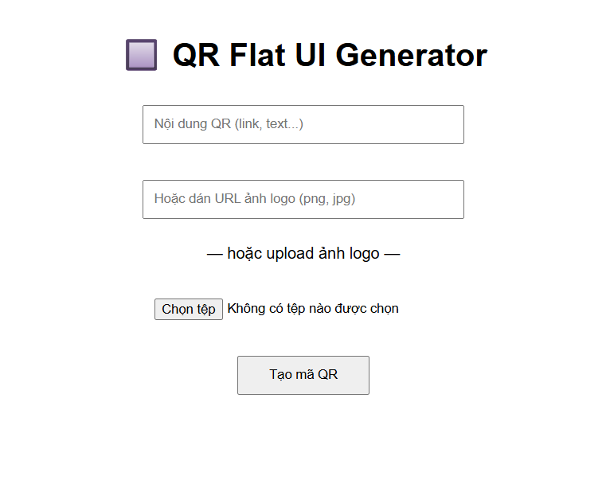

# QR Flat UI Generator


[](https://www.python.org/)
[](https://flask.palletsprojects.com/)
[](LICENSE)
[](#)
[](#)

A modern Flask-based web app that generates clean, scannable **QR codes** with embedded **logos**, following the Flat UI design style.

---

## Features

- Flat UI design — minimal and clean  
- Upload logo or paste image URL  
- Logo placed at center of QR code  
- High-resolution PNG output (800×800)  
- Built with Flask, Pillow, qrcode, requests

---

## Screenshot

 <!-- Replace with actual screenshot -->

---

## Installation

```bash
git clone https://github.com/mchoang98/qrcode_generator.git
cd qrcode_generator

python -m venv venv
source venv/bin/activate   # On Windows: venv\Scripts\activate

pip install -r requirements.txt
python app.py
